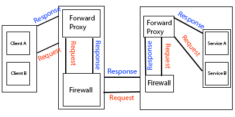

# Proxy Types

totally there are two categories for proxies:

- Reverse Proxy
  - this proxy is set in server side.
- Forward Proxy
  - this one is set in client side.

some Reverse proxy programs are as follow:

- httpd
- nginx
- iis
- haproxy

***

# Set Local Domain

first find what is your system IP by running following command:

-  ifconfig -a

after that open file (( /etc/hosts )) and add domain and IP address at the end of it with this format (( [system IP] [domain address] )); as following examples:

- 10.0.2.15 hamed.ir
- 10.0.2.15 wp.hamed.ir

you can have multiple domains by adding multiple mapping of IP to domain at the of this file. 

